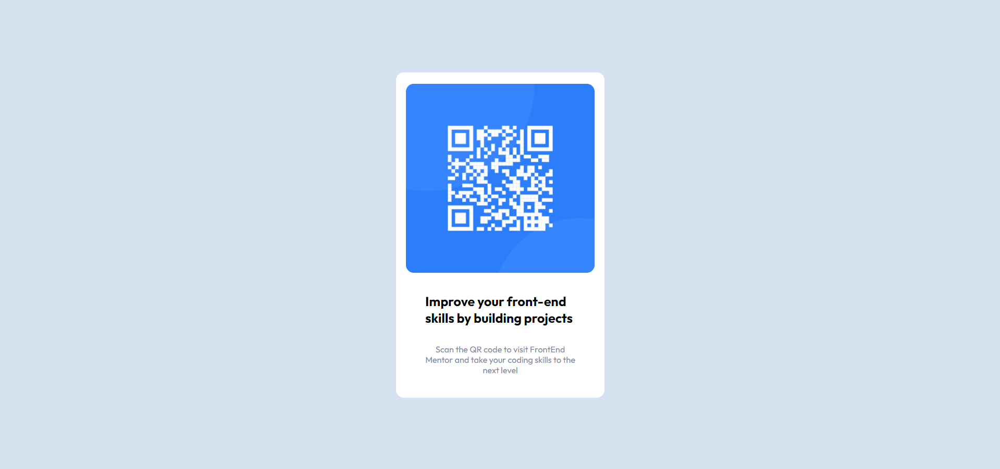

# Frontend Mentor - QR code component solution

This is a solution to the [QR code component challenge on Frontend Mentor](https://www.frontendmentor.io/challenges/qr-code-component-iux_sIO_H). Frontend Mentor challenges help you improve your coding skills by building realistic projects. 

## Table of contents

- [Overview](#overview)
  - [Screenshot](#screenshot)
- [My process](#my-process)
  - [Built with](#built-with)
  - [What I learned](#what-i-learned)
  - [Continued development](#continued-development)
- [Author](#author)

## Overview

### Screenshot

### Links

- Solution URL: [Add solution URL here](https://your-solution-url.com)

## My process

### Built with

- Semantic HTML5 markup
- Flexbox
- CSS Grid
- Desktop-first workflow

### What I learned

Nothing new but this project was a good refresher as I haven't posted a project in a while. 

## Author

- Website - [Robert Ortiz](https://portfolio-website-eight-woad.vercel.app/)
- Frontend Mentor - [@lastorbit](https://www.frontendmentor.io/profile/yourusername)
- github - [@last-orbit](https://github.com/last-orbit)
